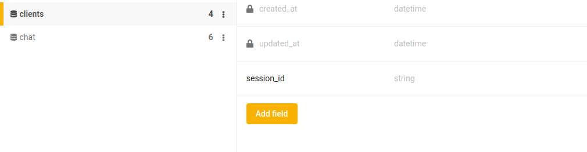
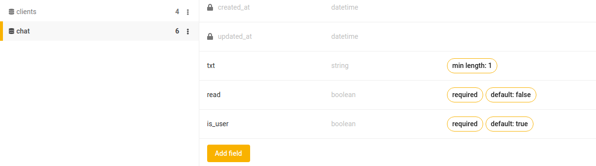
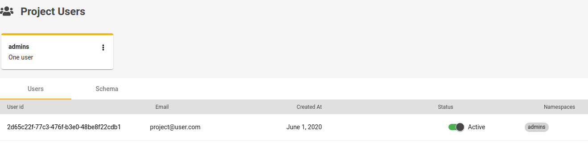
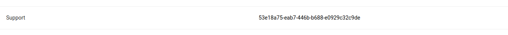
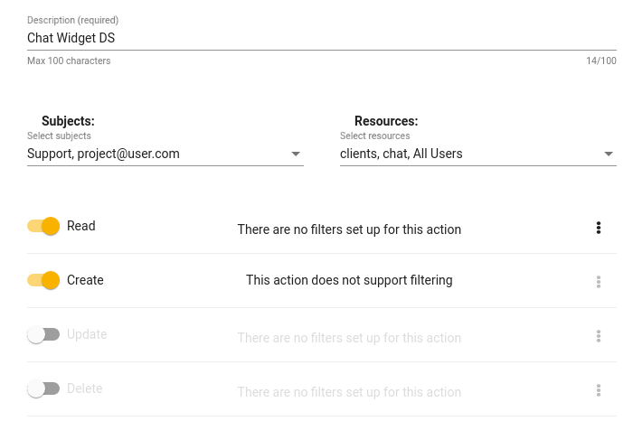

# Build a Customer Support Live Chat Widget with React and Jexia as backend

## What do you need
Pro project on Jexia.com
Modules: DataSet, Real-time communication, Project Users.  

## Running the demo

To run the demo first setup Jexia project:

1. We need to have dataset with name clients. You can use schemaless approach and do not create fields. I did it to have some basic validations and default values. In this dataset we will keep sessions which was open. 
2. We need to have another dataset with name chat to keep chat history between client and agent 
3. Create 1 project user for Agent 
4. Create API key / secret which we will put into `client/src/jexia.js` 
5. Setup policy for API, we need access for clients and chat dataset - Read, Create. 
6. `cd client && npm install`
7. `npm run start`

## How it works:
1. All Jexia initialization happned in `jexia.js`. We started and expose needed models of Jexia. Keep in mind UMS and Real-time it is a **pro** services. 
2. In Client.js you can find all functiones related to widget
3. In Agent.js all features related to `/admin`, which is agent area. 
4. We use 1 pre-defined agent in `Agent.js` which is created in Project user (point 3 above). 

If any quesiton feel free to ask in chat.jexia.com or via support. 
